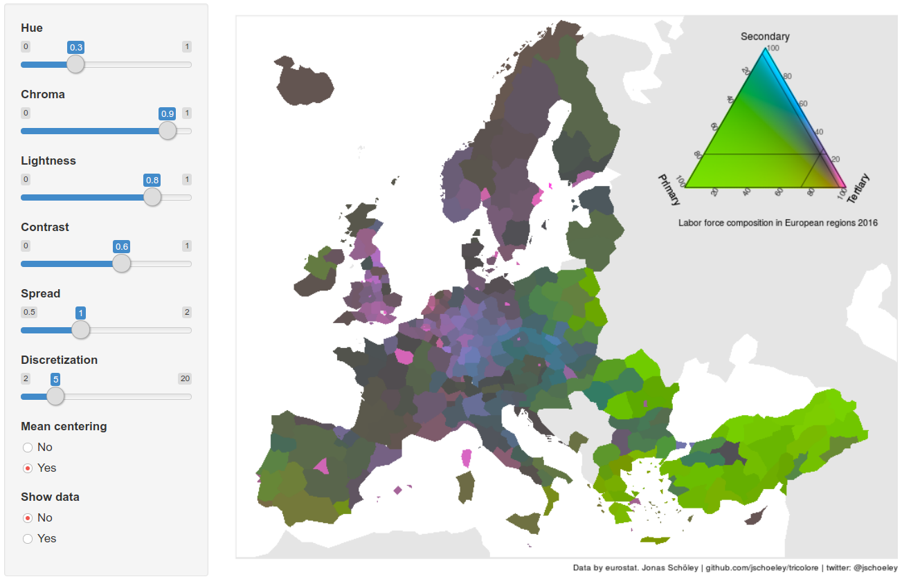
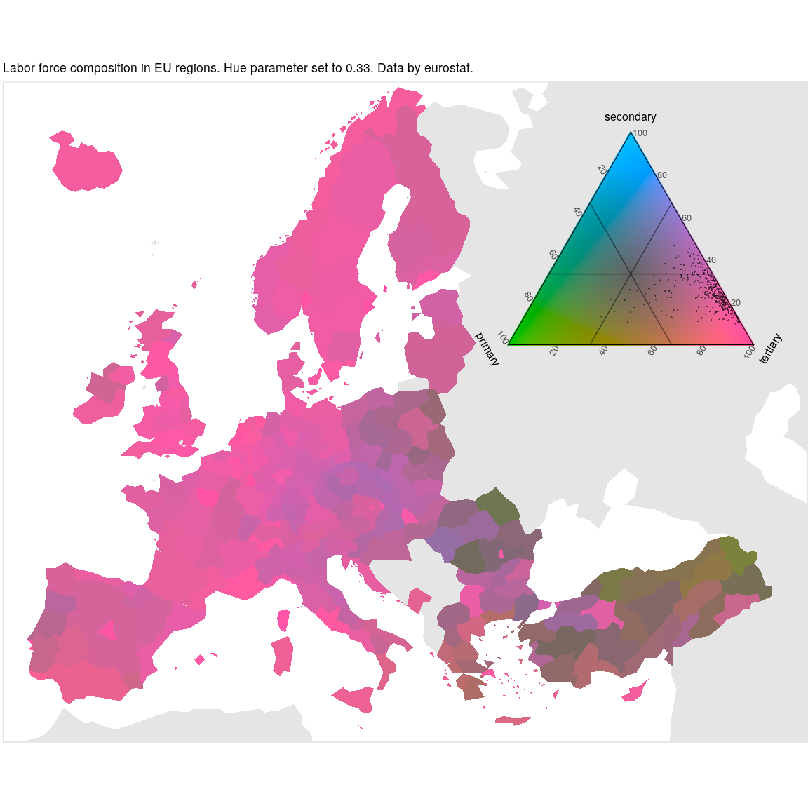
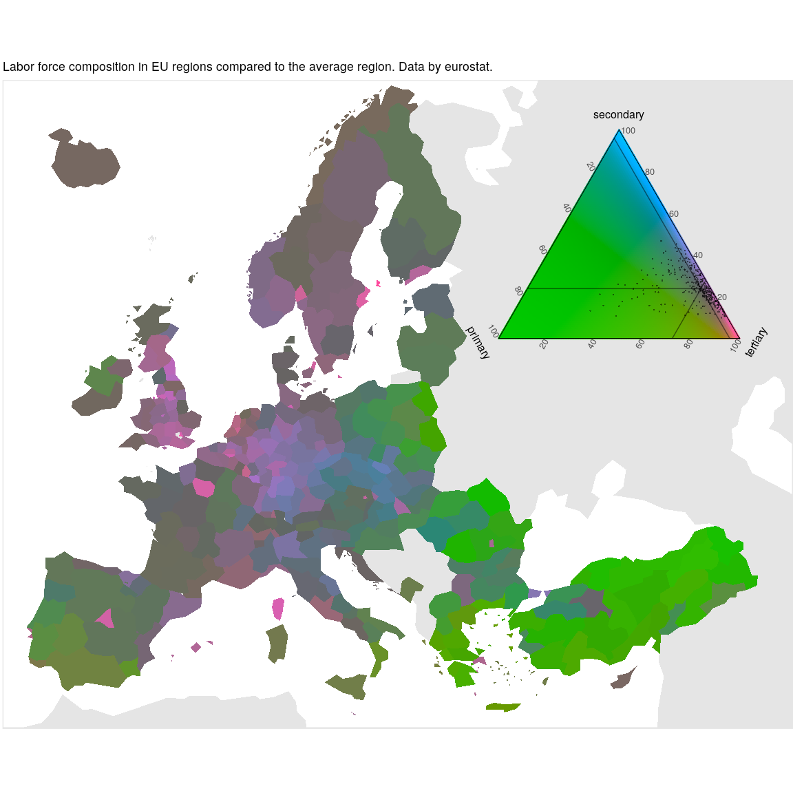

Tricolore. A flexible color scale for ternary compositions
================
Jonas Schöley

[]() [](https://travis-ci.org/jschoeley/tricolore) [](https://www.gnu.org/licenses/gpl-3.0)

What is *tricolore*?
--------------------

`tricolore` is an R library providing a flexible color scale for the visualization of three-part/ternary compositions. Its main functionality is to color-code any ternary composition as a mixture of three primary colours and to draw a suitable color-key. `tricolore` flexibly adapts to different visualisation challenges via

-   discrete and continuous color support
-   support for unbalanced compositional data via *centering*
-   support for data with very narrow range via *scaling*
-   hue, chroma and lightness options



Getting Started
---------------

You can install `tricolore` by running the following code from within an R session:

``` r
devtools::install_github('jschoeley/tricolore')
library(tricolore); DemoTricolore()
```

The `Tricolore()` function takes a data-frame of three-part compositions, color-codes them and returns a list with elements `hexsrgb` and `legend`. The first list element is a vector of rgb codes for the color-coded compositions, the latter element gives a plot of the color key.

Here's a minimal example using simulated data.

``` r
library(ggtern)
library(tricolore)

# simulate 243 ternary compositions
P <- as.data.frame(prop.table(matrix(runif(3^6), ncol = 3), 1))
# color-code each composition and return a corresponding color key
tric <- Tricolore(P, 'V1', 'V2', 'V3')
# the color-coded compositions
head(tric$hexsrgb)
```

    ## [1] "#738241FF" "#666974FF" "#00907FFF" "#619A00FF" "#6C6773FF" "#677BA9FF"

``` r
tric$legend
```


*A ternary color key with the color-coded compositional data visible as points.*

You can familiarize yourself with the various options of `tricolore` by running `DemoTricolore()`.

Case study: European labor force composition
--------------------------------------------

We are interested in the regional distribution of labor force by sector in the European Union. The `euro_sectors` data contains the share of workers in the three sectors for the year 2016 by NUTS-2 region.

``` r
head(euro_sectors)
```

    ## # A tibble: 6 x 4
    ##   id    primary secondary tertiary
    ##   <chr>   <dbl>     <dbl>    <dbl>
    ## 1 AT11  0.0442      0.268    0.682
    ## 2 AT12  0.0562      0.244    0.700
    ## 3 AT13  0.00518     0.143    0.852
    ## 4 AT21  0.0566      0.265    0.671
    ## 5 AT22  0.0610      0.292    0.647
    ## 6 AT31  0.0623      0.331    0.606

In order to prepare a map I've prepared a data frame with the outlines of the European NUTS-2 regions and neighbouring countries, `euro_geo_nuts2`.

``` r
head(euro_geo_nuts2)
```

    ##      long     lat order  hole piece   id  group
    ## 1 4786948 2658725     1 FALSE     1 AT11 AT11.1
    ## 2 4778299 2654263     2 FALSE     1 AT11 AT11.1
    ## 3 4786401 2720388     3 FALSE     1 AT11 AT11.1
    ## 4 4805178 2780047     4 FALSE     1 AT11 AT11.1
    ## 5 4846490 2803511     5 FALSE     1 AT11 AT11.1
    ## 6 4854633 2791782     6 FALSE     1 AT11 AT11.1

Using tricolore, I color-code each regions labor force composition and merge the resulting vector of hexsrgb color codes with the map data.

``` r
# generate colors based on compositions in `euro_sectors`, default options
tricol <- Tricolore(euro_sectors, 'primary', 'secondary', 'tertiary')

# merge vector of colors with with map data
euro_sectors$srgb <- tricol$hexsrgb
map_data <- dplyr::left_join(euro_geo_nuts2, euro_sectors, by = 'id')
```

I use `ggplot2` to plot a map of Europe with each NUTS-2 region shaded according to its corresponding hexsrgb values (`scale_fill_identity()`). I merge the color-key returned by `tricolore` with the map using the `annotation_custom()` function.

``` r
euro_basemap +
  geom_polygon(aes(long, lat, group = group, fill = srgb),
               data = map_data) +
  scale_fill_identity() +
  annotation_custom(
    ggplotGrob(
      tricol$legend +
        theme(plot.background = element_rect(fill = NA, color = NA))
    ),
    xmin = 53e5, xmax = Inf, ymin = 35e5, ymax = Inf) +
  labs(title = 'Labor force composition in EU regions. Default color scale options. Data by eurostat.')
```


Europe's labor force predominantly works in the tertiary sector, as seen by a map colored in various shades of blue. Reddish and greenish hues in eastern Europe indicate a higher share of primary and secondary labor force respectively.

I'm not happy with the basic colors used to represent primary, secondary, and tertiary sectors. I think its much more natural to encode the primary (agricultural) sector in green, the secondary (industrial) sector in blue and the tertiary (services) sector in red. This is easily achieved by changing *hue* parameter of the color scale.

``` r
tricol <- Tricolore(euro_sectors, 'primary', 'secondary', 'tertiary', hue = 0.33)
```

*In the examples to follow I omit the whole mapping code. It is identical for all examples.*



Up until now I used continuous colors to show the regional labor force composition. A discrete color scale introduces sharp contours which sometimes pronounce interesting patterns in the data. The `breaks` parameter determines the number of colors for the color scale. A value of 3 gives a discrete scale of 3^2=9 colors. The discrete scale pronounces the east-west divide in labor force composition.

``` r
tricol <- Tricolore(euro_sectors, 'primary', 'secondary', 'tertiary', hue = 0.33, breaks = 3)
```


A technique I've adopted from compositional data analysis is *ternary centering*. Centering shifts the center of the color scale (the greypoint) to the center of the data and thereby shows deviations from the average composition. It's the ternary equivalent to a divergent color-scale with the average value at the midpoint.

Centering the color scale over the labor-force composition of the average European NUTS-2 region shows various patterns of deviations from the average. Metropolitan regions (Hamburg, Stockholm, Paris, Madrid) have a higher than average share of tertiary workers. Large parts of France are quite grey, indicating a labor-force composition close to the average, while Eastern Europe, the south of Spain and Italy have a higher than average share of workers active in the primary sector.

``` r
tricol <- Tricolore(euro_sectors, 'primary', 'secondary', 'tertiary',
                    hue = 0.33, center = NA)
```


